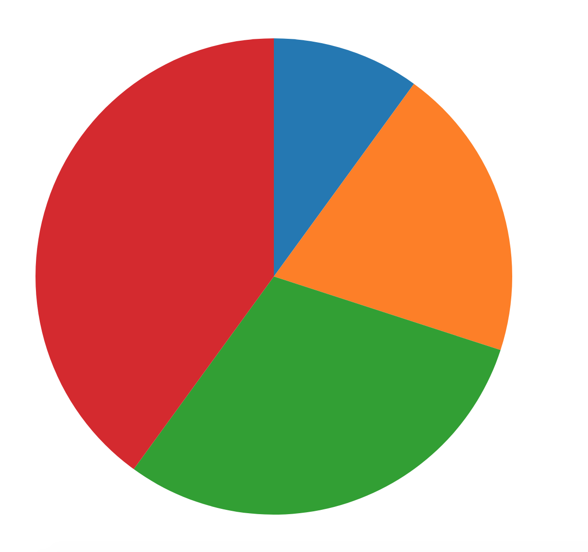
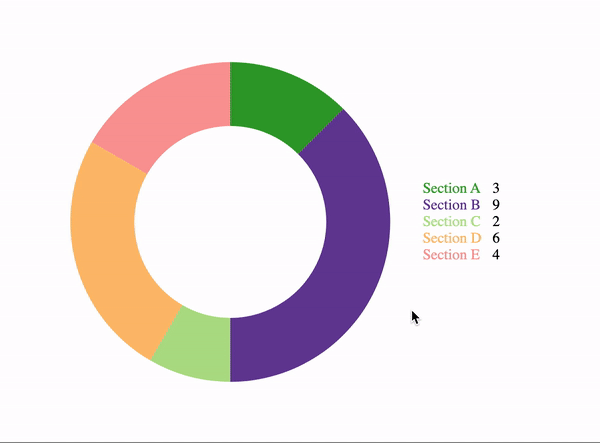
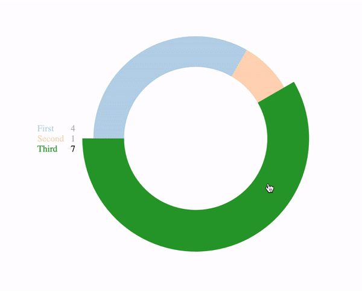
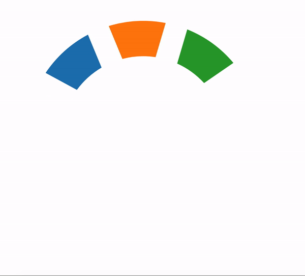

# vue-pie

## Add to project
```
npm install vue-pie
```

## Description
Vue pie chart component built with d3

## Project Dependencies
d4

## Props
| Prop | Required | Description | Default |
| --- | --- | ----------- | ----------- |


## Examples








