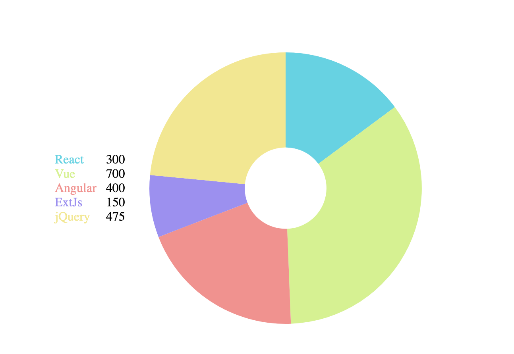

# vue-pie

## Add to project
```
npm install vpie
```

## Description
Vue pie chart component built with d3


## Project Dependencies
d3

## Props
The data element passed to functions is either the array element from the chartData or the property value of the chartData for the sectionKey. The id passed to functions is the sectionKey or the value returned from the selectIdentifier function.

| Prop | Required | Type | Description | Default |
| --- | --- | --- | ----------- | ----------- |
| Width | No | Number | Width of pie and legend | Container width |
| Height | No | Number | Height of pie and legend | Container width (to make a square) |
| chartData | Yes | Array or Object | The pie data. If it is an array then each element is its own section. If it's an object then the sectionKeys array will determine the sections. | |
| sectionKeys | No | Array | If the chartData is an object then this should be an array of which of it's properties should be sections. | [ ] |
| selectIdentifier | No | Function | This function is assign a unique identifier to each section. It receives the data element and the index within chartData and should return a unique representation of the section, either string or number. When the chart is built from sectionKeys the key is used as the id. | <span>Returns the index.<br/> (_,i) => i</span>|
| selectValue | No | Function | This function is used to pull the value that is being displayed by the pie chart. It receives the data element and the id and should return a numeric value. |  <span>Returns the data element.<br/> (d) => d</span> |
| selectColor | No | Function | This function is used to pull the color for the section. It receives the data element and the id and should return a string hex code. | Returns a color from the d3 schemeCategory10 colors based on index. |
| sort | No | Function | This should be a comparator function to sort the pie data in the order the sections should be drawn. It is comparing the data elements. If it isn't passed then the order the chartData/sectionKeys was passed will be the default sort. | null |
| innerRadiusPercent | No | Number between 0 and 1 | This percentage determines how far the sections go to the center point of the pie. A higher number means thinner sections (more donut like). 0 means a full pie chart. | 0 |
| startAngle | No | Number | The angle in radians where the first section of the pie chart will start from. | 0 |
| endAngle | No | Number | The angle in radians where the last section of the pie chart will finish. | 2 * pi |
| padAngle | No | Number | The angle used for padding between the sections. 0 means the sections will touch. | 0 |
| transitionDuration | No | Number | The time in seconds for the drawing/changing data transition. The hover/click transition is 1/3 of this value | 1500 |
| legendLocation | No | String (left, right, top, bottom) | The location in relation to the chart to display the legend. If nothing is passed then the legend won't display. | null |
| formatLegendHtml | No | Function | This function should return the html as a string that should be used for each section's legend display. | Displays the legend label from formatLegend function in the color of the section and the value to the right in black. (See examples below) |
| formatLegend | No | Function | This function is used to pull the value that should be displayed in the legend for the section if the default html legend format is used (formatLegendHtml is not passed). |  <span>Returns the identifier.<br/> (_,id) => id</span> |
| hoverAnimation | No | Booleam | Whether or not the chart should allow sections to be hovered over and have the other default hover animation (see examples below) | false |
| maxSelectedSections | No | Number | If this is zero then the click to select section interaction is disabled. Otherwise it is enabled (see examples below). If this is a number than up to that many sections can be selected at once before clicking unselected sections does nothing. If null is passed then all sections can be clicked at once. | 0 |
| selectedSectionIncreasePercent | No | Number between 0 and 1 | If hovering or selecting is enabled then this is how much the outer radius should grow by when a section is hovered or selected (see examples below) | 0.1 |


## Events
| Name | Arguments | Description |
| --- | --- | ----------- |
| Hover | Identifier | If hoverAnimation is set to true and no section is in a clicked state then this emitted when a section is moused overed or moused out. The identifier for which is currently hovered, or null when moving off a section, is passed. |
| Selected | Identifier | If sections are allowed to be in a clicked state (maxSelectedSections != 0) this is emitted when a new section is selected by either clicking the section or the legend element. |
| Unselected | | If sections are allowed to be in a clicked state (maxSelectedSections != 0) this is emitted when a selected section is de-selected by either clicking the section or the legend element. |

## Examples
<div style="display: flex;flex-wrap: wrap;">
  

  

  

  

  

  
</div>

````html
<pie-chart
  :chartData="{
    a: {
      val: 300,
      col: '#62d2e3',
      label: 'React'
    },
    b: {
      val: 700,
      col: '#d5f28d',
      label: 'Vue'
    },
    c: {
      val: 400,
      col: '#f2928d',
      label: 'Angular'
    },
    d: {
      val: 150,
      col: '#9c8df2',
      label: 'ExtJs'
    },
    e: {
      val: 475,
      col: '#f2e88d',
      label: 'jQuery'
    }
  }"
  :sectionKeys="['a','b','c','d','e']"
  :selectValue="(d) => d.val"
  :selectColor="(d) => d.col"
  :innerRadiusPercent="0.3"
  legendLocation="left"
  :formatLegend="(d) => d.label"
  :maxSelectedSections="1"
/>
````